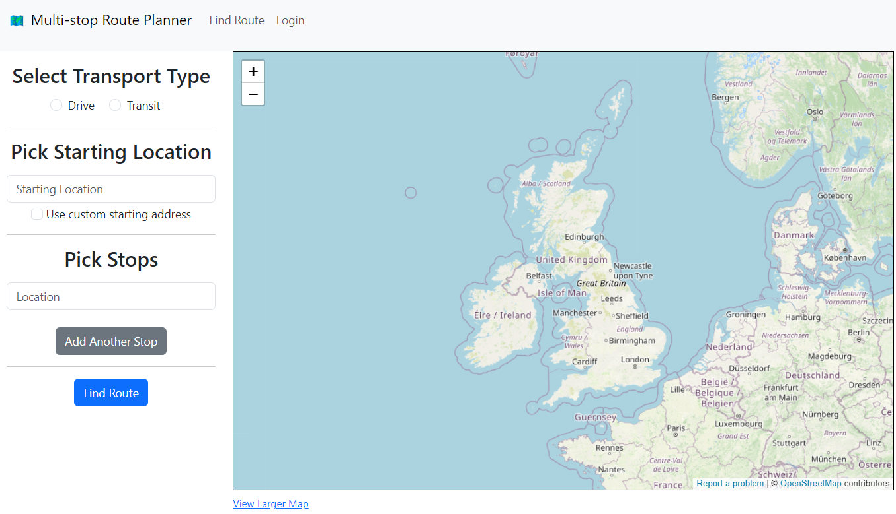
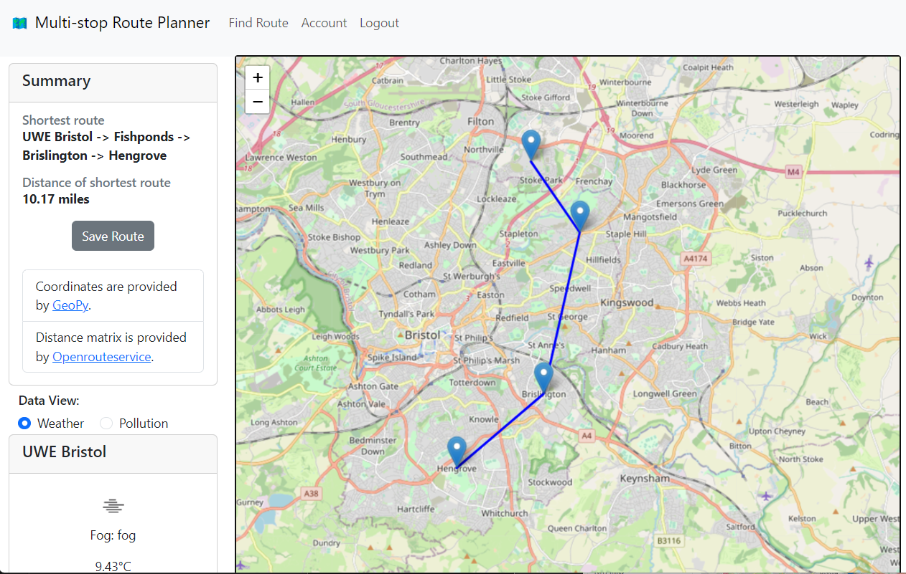
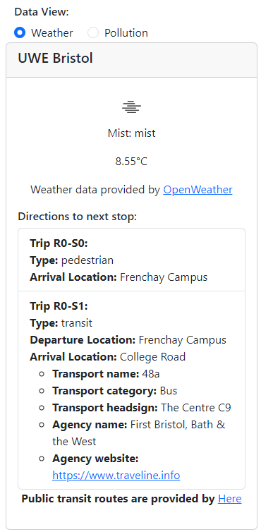
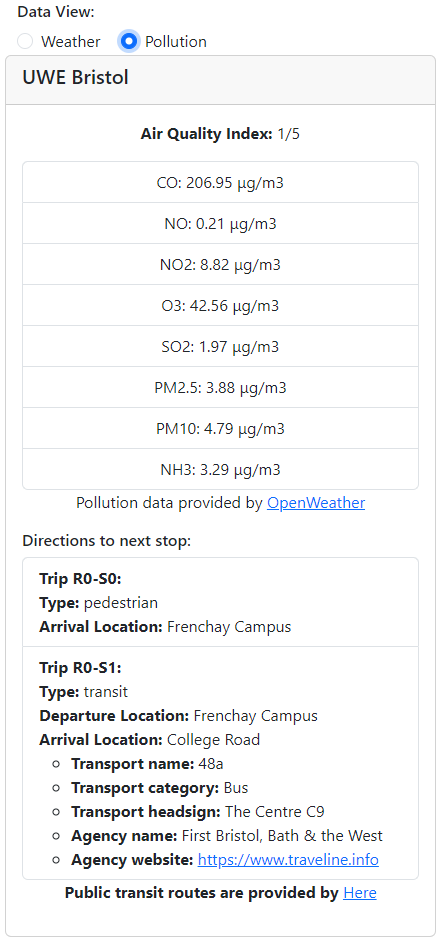
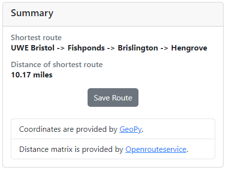
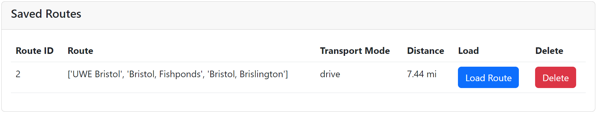
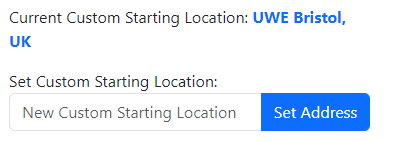

# Ryan Morgan
# Multi-stop Route Planner with Informative Data.

This is the final year project (digital systems project) for the multi-stop route planner project, which allows users to efficiently plan journeys and view informative data to inform thier travel decisions.

## Prerequisites for running the project.
**API keys are not included in this repository for security reasons.** Therefore, API keys are needed from these services:
* API token from the [Openrouteservice](https://openrouteservice.org/ "Openrouteservice website") for getting the distance matrix.
* API key from [OpenWeatherMap](https://openweathermap.org/appid "Title") for weather and pollution data.
* API key from [HERE](https://developer.here.com/tutorials/getting-here-credentials/ "Tutorial for getting HERE API key") for public transit routes.

## How to run.
**It's important to firstly open the project as the route directory (preferably in VSCode).**

Either have the required Python modules installed on the host machine or create a Python virtual environment. The required modules are listed in the 'requirements.txt' file.

### Running the project in a virtual environment.
If making a Python virtual environment, run this command to create one (from VSCode terminal):
'**python -m venv .venv**'

If the environment is not already activated, then activate it (command for Windows):
'**.venv/Scripts/activate**'.

It maybe **. .venv/bin/activate** for the MacOS operating system.

Once the virtual environment is running, install the required Python modules:
'**pip install -r requirements.txt**'

Finally, run this command to start the Flask app:
'**flask --app routes run**'

Alternatively, only if a Python virtual environment is not being used, simply run the **routes.py** file in VSCode to start the Flask app.

There's already a test account in the database for testing reasons:
* Email: test@email.com
* Password: test 

 

 

